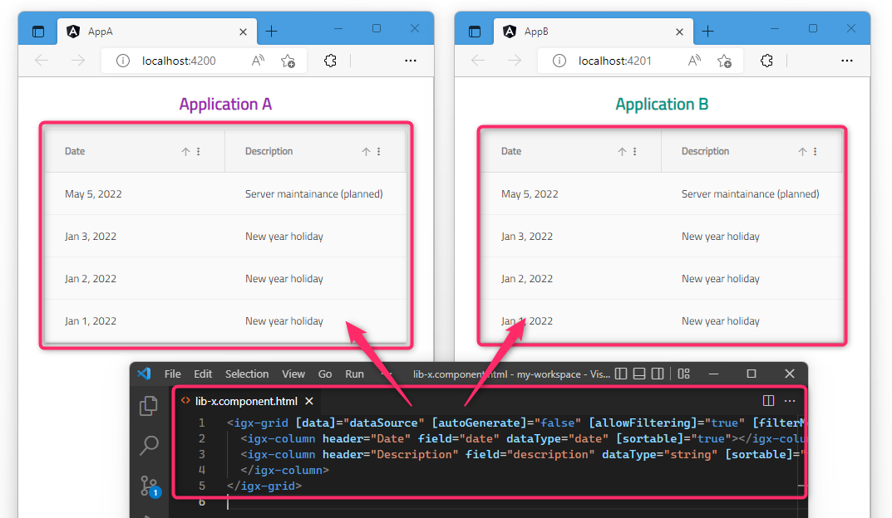

# Angular アプリ開発 - Ignite UI for Angular を使ったコンポーネントを共通ライブラリ化し、複数アプリから使用する開発環境を構築する

## 概要

このリポジトリは、インフラジスティックス・ジャパン株式会社 Blog の下記記事で紹介しているサンプルアプリケーションのソースコード一式です。

[📰 "Angular アプリ開発 - Ignite UI for Angular を使ったコンポーネントを共通ライブラリ化し、複数アプリから使用する開発環境を構築する"](https://blogs.jp.infragistics.com/entry/use-igniteui-for-angular-in-shared-library)

Ignite UI for Angular を使用した Angular コンポーネントを、Angular ライブラリとして実装し、他の Angular アプリケーションからの共通機能として使用する例を示しています。

このリポジトリのコミット履歴には、上記のとおりの Angular アプリケーションを開発する作業手順が記録されています。
